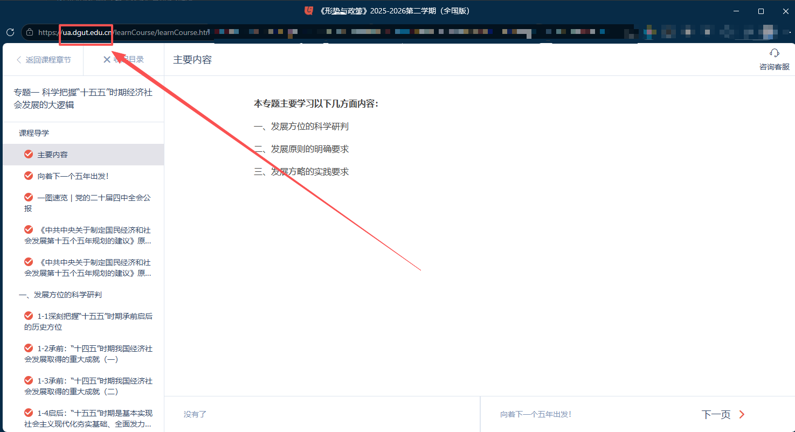

# 优学院自动学习脚本

一个用于优学院（youxueyuan）平台的油猴脚本（UserScript），支持自动播放视频、自动答题、自动翻页等功能。

## 功能特性

### 视频播放控制
- ✅ 自动播放视频内容
- ✅ 自动静音播放
- ✅ 自定义播放速率（0.25x - 15x）
- ✅ 自动检测视频播放状态
- ✅ 视频播放完成后自动翻页

### 自动答题系统
- ✅ 自动显示题目答案
- ✅ 自动作答选择题（单选/多选）
- ✅ 自动作答判断题
- ✅ 自动填写填空题和简答题
- ✅ 智能答案匹配和填充

### 智能导航
- ✅ 自动翻页到下一章节
- ✅ 模态框自动处理
- ✅ 错误页面自动重试
- ✅ 挂机检测绕过（模拟鼠标移动）

### 用户界面
- ✅ 可拖拽控制面板
- ✅ 可视化设置界面
- ✅ 设置自动保存到本地存储
- ✅ 响应式设计，支持移动端

### 系统架构
- ✅ **配置集中管理**：ConfigManager 类统一管理所有设置，支持旧配置迁移
- ✅ **统一日志系统**：Logger 类提供分级日志输出（DEBUG、INFO、WARN、ERROR）
- ✅ **代码模块化**：按功能模块组织代码，提高可维护性
- ✅ **详尽注释**：添加全面中文注释，便于理解和二次开发

## 安装方法

**重要**：由于本脚本未上传至油猴脚本平台，**必须使用手动安装方式**。

### 手动安装步骤
1. **安装油猴脚本管理器**：在浏览器中安装 Tampermonkey 或 Violentmonkey 扩展
2. **下载脚本文件**：点击 [youxueyuan.js](youxueyuan.js) 下载脚本文件，或复制脚本内容
3. **创建新脚本**：在油猴脚本管理器中点击"添加新脚本"或"创建新脚本"
4. **粘贴脚本内容**：将脚本内容粘贴到编辑器中
5. **修改匹配地址（重要）**：
   - 脚本默认匹配东莞理工学院的优学院地址：`*://ua.dgut.edu.cn/learnCourse/*`
   - 其他学校的用户需要修改 `@match` 指令（第7行）为自己的优学院地址
   - 常见地址格式：`*://你的学校域名/learnCourse/*` 或 `*://你的学校域名/ulearning/*`
6. **保存脚本**：点击保存，脚本将自动生效

### 项目说明
- **项目来源**：本项目基于 [EliotZhang](mailto:moriartylimitter@outlook.com) 和 [Brush-JIM](mailto:Brush-JIM@protonmail.com) 的原版脚本，经过全面重构优化，增加配置管理、日志系统，并修复多选题解析
- **适用对象**：需要在优学院平台自动学习的学生
- **注意事项**：请遵守学校平台使用规定，合理使用自动化功能

## 使用方法

**前提**：确保已按照安装步骤正确安装脚本，并修改了匹配地址。

1. 访问优学院课程页面（确保地址与脚本的`@match`设置匹配）
   
2. 页面右上角会出现"UL"控制球体
3. 点击球体显示控制面板
4. 根据需要调整设置
5. 点击"保存设置并刷新脚本"应用配置

> **匹配地址提示**：如果脚本不生效，请检查`@match`指令是否匹配当前访问的优学院地址。常见格式：`*://你的学校域名/learnCourse/*` 或 `*://你的学校域名/ulearning/*`

## 配置选项

### 视频播放设置
- **自动翻页、播放视频**：总开关，控制自动播放功能
- **自动静音**：播放时自动静音
- **自动调整速率**：自动设置播放速度
- **播放速率**：设置播放速度（0.25-15倍）

### 自动作答设置
- **自动作答**：总开关，控制自动答题功能
- **自动显示答案**：在题目下方显示正确答案
- **自动作答选择题**：自动选择正确答案
- **自动作答判断题**：自动判断对错
- **自动作答填空、简答题**：自动填写答案

## 更新历史

### v2.0.0 (2026-04-09)
- 🔄 **全面重构**：代码结构全面重构，提升可维护性
- 🧩 **配置管理系统**：新增 ConfigManager 类，集中管理配置，支持旧格式迁移
- 📝 **统一日志系统**：新增 Logger 类，支持不同日志级别（DEBUG、INFO、WARN、ERROR）
- 🐛 **多选题解析修复**：修复逗号分隔多选题答案解析（如"A,B,C,D"格式）
- ♻️ **变量命名优化**：所有全局配置变量重命名，提高代码可读性
- 📦 **模块化组织**：代码按功能模块化组织，添加详细中文注释
- ⬆️ **版本升级**：脚本版本升级至 2.0.0（重构版）

### v1.6.2 (2026-04-08)
- 🔧 **CSS内联修复**：将外部CSS样式内联到脚本中，解决UI面板显示问题
- 🐛 **错误处理增强**：添加初始化错误处理机制
- 📝 **文档更新**：创建完整的项目文档

### v1.6.1 (2020-06-04) - 原始版本
- 🎯 **初始发布**：包含所有核心功能
- 👥 **作者**：EliotZhang、Brush-JIM

## 注意事项

1. **使用风险**：修改播放速率功能请谨慎使用，产生的不良后果概不承担
2. **挂机检测**：平台有挂机检测功能，建议保持页面活动状态
3. **答题限制**：目前支持单/多项选择、判断题、部分填空问答题
4. **网络要求**：需要稳定的网络连接访问API接口

## 故障排除

### 脚本无效
1. 刷新页面重试
2. 检查油猴脚本管理器是否启用
3. **检查匹配地址是否正确**：确认脚本的`@match`指令是否匹配当前访问的优学院地址
4. 检查是否在正确的课程页面

### 功能异常
1. 尝试禁用特定功能后重新启用
2. 检查浏览器控制台是否有错误信息
3. 清除本地存储后重新配置

### API访问失败
1. 检查网络连接
2. 确认API端点可访问
3. 可能需要等待网络恢复

## 项目结构

```
youxueyuan.js          # 主脚本文件
README.md             # 项目文档
.gitignore            # Git忽略配置
```

## 技术栈

- **JavaScript**：核心脚本语言
- **jQuery 3.4.1**：DOM操作和AJAX
- **jQuery UI 1.12.1**：拖拽功能
- **CSS3**：内联样式，现代化UI设计
- **LocalStorage**：配置持久化存储
- **配置管理**：ConfigManager 类，支持版本迁移和集中管理
- **日志系统**：Logger 类，支持分级日志输出和统一格式化

## 贡献指南

1. Fork 项目
2. 创建功能分支 (`git checkout -b feature/amazing-feature`)
3. 提交更改 (`git commit -m 'Add amazing feature'`)
4. 推送到分支 (`git push origin feature/amazing-feature`)
5. 打开 Pull Request

## 许可证

本项目基于MIT许可证开源，仅供学习和研究使用。

## 免责声明

本脚本仅供学习交流使用，请遵守优学院平台的使用条款。不当使用造成的任何后果，作者概不负责。

## 联系作者

- **EliotZhang**：moriartylimitter@outlook.com
- **Brush-JIM**：Brush-JIM@protonmail.com
- **重构优化**：Claude Code (Anthropic's AI Assistant)

---

**最后更新**：2026年4月9日  
**当前版本**：v2.0.0  
**兼容性**：Chrome, Firefox, Edge + 油猴脚本管理器